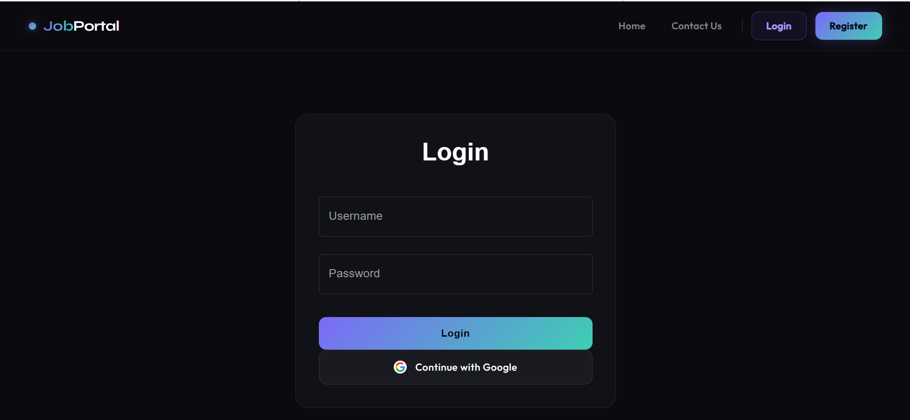
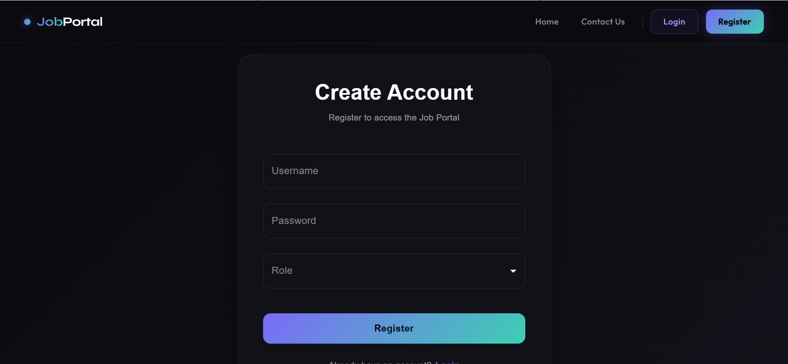
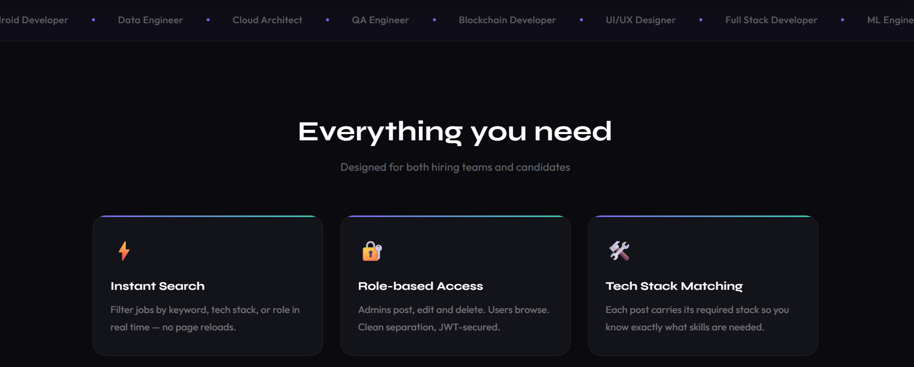
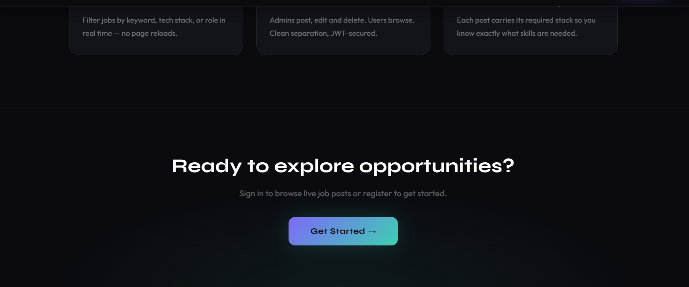
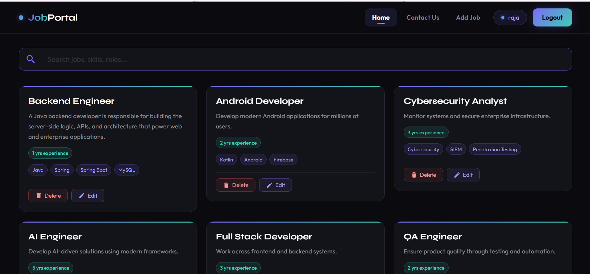
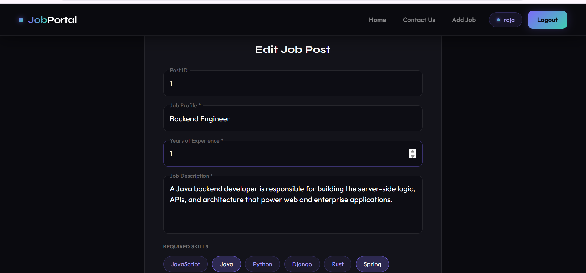
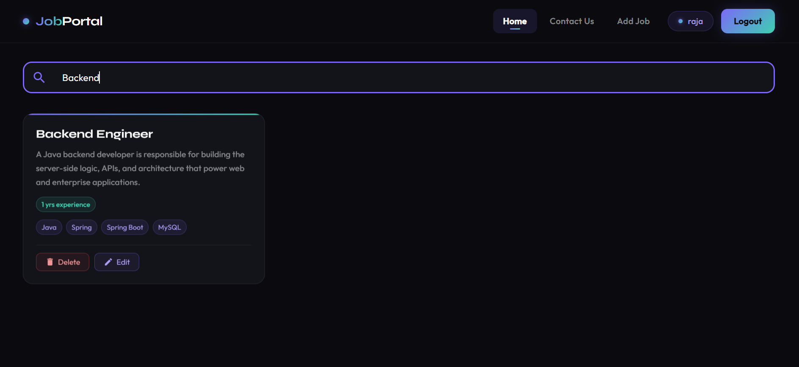

# Search Delete Job Post Project - Full Stack

## Overview

A full-stack web application that allows users to manage job postings efficiently. The application provides functionality to create, search, view, update, and delete job posts through an intuitive user interface.

## Features

* Create new job postings
* View all available job posts
* Search job posts by keywords
* Update existing job posts
* Delete job posts
* Responsive user interface
* RESTful API integration between frontend and backend

## Tech Stack

### Frontend

* React.js
* HTML5
* CSS3
* JavaScript
* Axios

### Backend

* Java
* Spring Boot
* Spring Data JPA
* Maven

### Database

* PostgreSQL / MySQL (Update based on your project)

## Project Structure

```text
project-root/
│
├── frontend/
│   ├── src/
│   ├── public/
│   └── package.json
│
├── backend/
│   ├── src/
│   ├── pom.xml
│   └── application.properties
│
└── README.md
```

## Installation

### Clone Repository

```bash
git clone <repository-url>
cd <project-folder>
```

### Backend Setup

```bash
cd backend
mvn clean install
mvn spring-boot:run
```

Backend runs on:

```text
http://localhost:8080
```

### Frontend Setup

```bash
cd frontend
npm install
npm start
```

Frontend runs on:

```text
http://localhost:3000
```

## API Endpoints

| Method | Endpoint   | Description   |
| ------ | ---------- | ------------- |
| GET    | /jobs      | Get all jobs  |
| GET    | /jobs/{id} | Get job by ID |
| POST   | /jobs      | Create job    |
| PUT    | /jobs/{id} | Update job    |
| DELETE | /jobs/{id} | Delete job    |

## Application Screenshots

### Login Page



### Registration Page



### Home Page - 




## 👨‍💼 Admin Module

### Admin Dashboard

The Admin Dashboard provides complete control over job postings. Administrators can view all jobs, manage listings, and perform administrative operations.



---

### Edit Job Post

Administrators can update existing job details such as title, description, required skills, company information, and other job-related data.



---

## 🔍 Search Functionality

### Search Jobs

Users can search job postings using keywords, technologies, company names, or job roles. The search feature helps users quickly find relevant opportunities.



---

## 🚀 Key Functionalities Demonstrated

- User Registration and Login
- Role-Based Access (User/Admin)
- Create Job Post
- View Job Listings
- Search Jobs
- Update Job Details
- Delete Job Posts
- Responsive User Interface
- REST API Integration
- Database Connectivity

---

## 📈 Future Enhancements

- JWT Authentication
- Email Notifications
- Resume Upload Feature
- Job Application Tracking
- Advanced Filters
- Pagination and Sorting
- Docker Containerization
- Cloud Deployment (AWS/Render)

---

## Author

**Shekhar Patil**

* Java Full Stack Developer
* Spring Boot | React | SQL | PostgreSQL

## License

This project is developed for learning and portfolio purposes.
